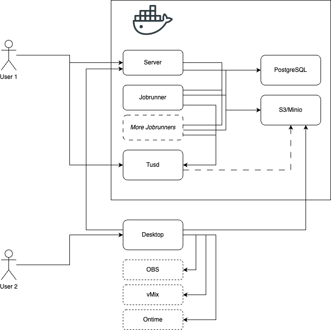

# Introduction to Badger

Badger is a tool to help with media management and automation for live broadcast.

It provides a web-based tool to set up show rundowns and upload media files, and a desktop app to interface with [OBS](https://obsproject.com/), [vMix](https://www.vmix.com/), and [Ontime](https://getontime.no/).

## Architecture

Badger has three primary components: Server, Jobrunner, and Desktop.

Server provides the web interface for setting up shows.

Jobrunner handles media processing, including checking file quality and normalising loudness.

Desktop interfaces with Server to automatically import media into OBS and vMix, and load the running order into Ontime.

Badger also requires a few other services to function:

- A [PostgreSQL](https://www.postgresql.org/) database
- [Minio](https://min.io/) (or other S3-compatible) file storage
- [Tusd](https://github.com/tus/tusd) (or other [Tus](https://tus.io)-compatible) file upload server

